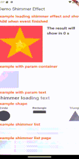

### ☕ Buy Me a Coffee

[](https://buymeacoffee.com/bimki)

# 🔽 Shimmer Effect (Flutter)

shimmer_effects_plus is a Flutter package that creates a shimmering loading effect to indicate content is being loaded. It allows you to wrap any widget with a customizable animated placeholder. You can easily adjust the shimmer’s color, speed, and direction to match your app's design.

---

## 🎬 Demo Video

---

## 📱 Use Cases

- Simulate loading state for cards, lists, avatars, or detail sections.
- Improve perceived performance while fetching data.
- Display animated placeholders for text, images, or custom widgets.

---

## ✨ Features

- 🔄 Repeating shimmer animation
- 🎨 Custom colors (mainColor, subColor)
- ⏱ Custom animation duration (period)
- 🔄 Supports left-to-right, right-to-left, top-to-bottom, bottom-to-top directions
- 🟦 Built-in widgets: ShimmerEffectWidget.cover, ShimmerEffectWidget.circle, ShimmerEffectWidget.triangle, ShimmerEffectWidget.rectangle
- ✅ Enable or disable shimmer with enabled flag
- Lightweight and fast.

---

## 🏗️ Architecture & Technologies


| Component              | Description                                                    |
|------------------------|----------------------------------------------------------------|
| `ShimmerEffectWidget`  | Main shimmer wrapper with configurable animation               |
| `ShimmerController`    | Main controller to control state of shimmer (animation,enable) |
| `ShimmerDirection`     | Enum for controlling animation direction (LTR, RTL, TTB, BTT)  |
| `ShimmerData`          | Stores default color and timing configurations                 |
| `SlideGradient`        | Gradient transform logic for animating the shimmer             |

---

## 🧾 Constructor Parameters

| Field                            | Type               | Default                   | Description                                      |
|----------------------------------|--------------------|---------------------------|--------------------------------------------------|
| `child`                          | `Widget`           | **required**              | The content widget shown when expanded.          |
| `subColor`                       | `Color`            | `FFEDF1F4`                | The sub color of gradient effect.                |
| `mainColor`                      | `Color`            | `FFC3CBDC`                | The main color of gradient effect.               |
| `period`                         | `Duration`         | `1.2s`                    | Duration for one shimmer loop                    |
| `direction`                      | `ShimmerDirection` | `ShimmerDirection.ltr`    | Direction of shimmer movement                    |
| `enabled`                        | `bool`             | `true`                    | Toggle shimmer animation on/off                  |
| `size`                           | `double`           | **required**              | The size circle, triangle of ShimmerEffectWidget |
| `width`                          | `double`           | **required**              | Width of shimmer shape rectangle                 |
| `height`                         | `double`           | **required**              | Height of shimmer shape rectangle                |
| `radius` *(rectangle)*           | `double`           | `0.0`                     | Radius of rectangle shimmer widget               |
| `qtyLine` *(ShimmerList)*        | `int`              | **required**              | Line for ShimmerList will display shimmer        |
| `qtyPerLine` *(ShimmerListPage)* | `int`              | `3`                       | Line for ShimmerListPage will display shimmer    |
| `shape` *(ShimmerListPage)*      | `ShimmerShapeType` | `ShimmerShapeType.square` | Shape of main info list page                     |
| `quantity` *(ShimmerListPage)*   | `int`              | `3`                       | Quantity of list in page                         |
---

## 🚀 Usage

### ✅ Basic Usage

#### 📏 Basic Shimmer cover

```dart
ShimmerEffectWidget.cover(
    subColor: Colors.grey[300]!,
    mainColor: Colors.grey[100]!,
    period: const Duration(milliseconds: 1200),
    direction: ShimmerDirection.ttb,
    child: Container(width: 100, height: 100, color: Colors.white),
)
```

#### 📏 Basic Shimmer cover (Text)

```dart
ShimmerEffectWidget.cover(
    subColor: Colors.grey[800]!,
    mainColor: Colors.grey[400]!,
    period: const Duration(milliseconds: 1500),
    direction: ShimmerDirection.ttb,
    child: const Text("Shimmer loading text", style: TextStyle(fontSize: 25, fontWeight: FontWeight.w500),),
),
```

#### 🟢 Circular shimmer (e.g., for avatar)

```dart
ShimmerEffectWidget.circle(size: 60),
```

#### 🔺 Shimmer Triangle

```dart
ShimmerEffectWidget.triangle(size: 60),
```

#### ✅ Shimmer Triangle

```dart
ShimmerEffectWidget.rectangle(width: 60, height: 15,),
```

#### 📋 Shimmer List

```dart
const ShimmerList(
  qtyLine: 2,
),
```

#### 📄 Shimmer List Page

```dart
const ShimmerListPage(
    qtyPerLine: 3,
    quantity: 3,
    shape: ShimmerShapeType.square,
),
```

---

## ⚙️ Setup

To install the `shimmer_effects_plus` package, add the following to your `pubspec.yaml` file:

```yaml
dependencies:
  expandable_tile: ^1.0.1
```
## 📦 Supported SDKs

- **Flutter**: Stable channel
- **Android**: SDK 21+
- **iOS**: iOS 9+

---

## 🙌 Contributions

Feel free to open issues or pull requests on [GitHub](https://github.com/BimKi1604/shimmer_effects_plus).

---

## 📄 License

MIT License. See [LICENSE](LICENSE) for details.
